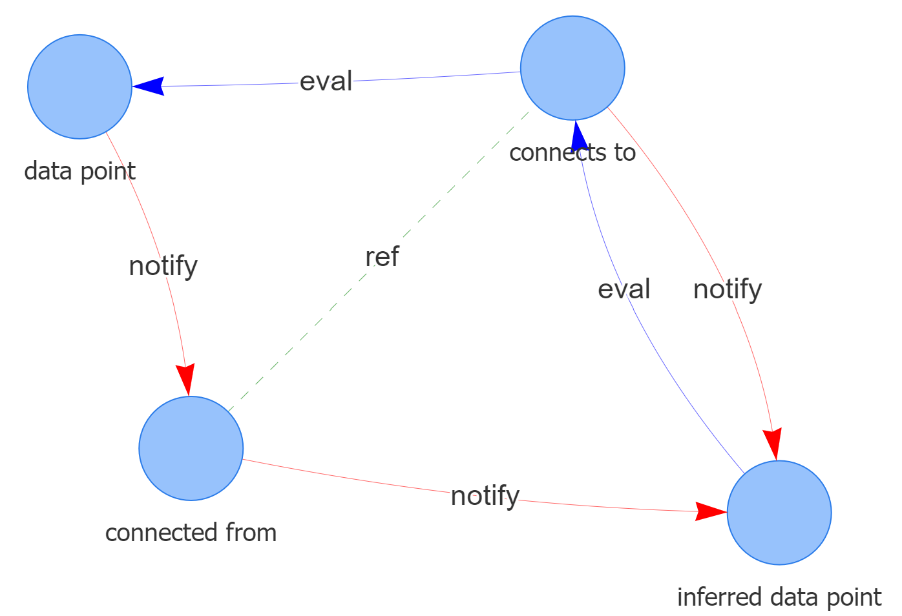
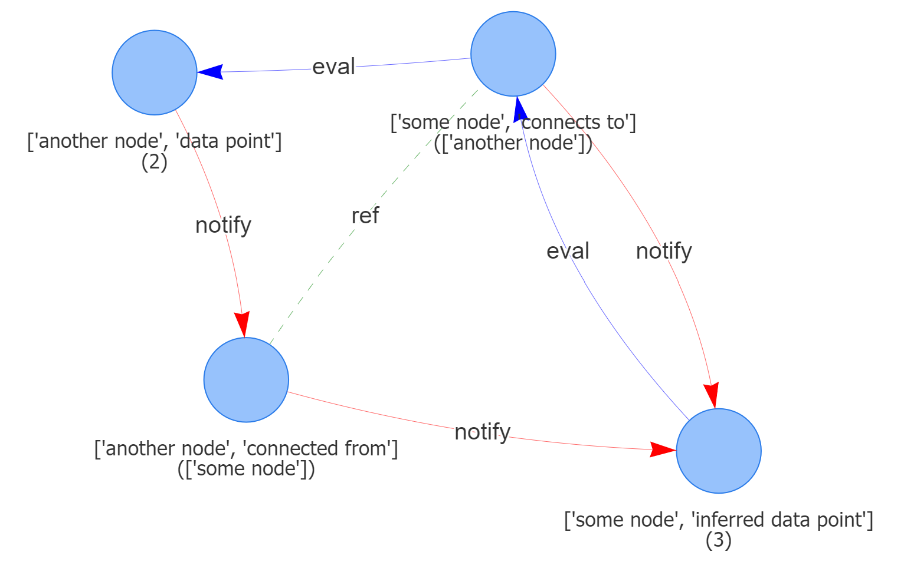

# baby-ginfer

[](https://clojars.org/com.github.s-doti/baby-ginfer)

A baby version of the Ginfer (graph inference) library.

This baby is designed with the sole purpose of delivering a gist.
Its [core](src/baby_ginfer/core.clj) weighs less than 100 lines of code, and still supports the basic concepts:
- Declarative graph structure (aka graph blueprints)
- Separation of execution context and logic
- Agnostic to state/data-model, or even storage tech
- Notifications & evaluations along paths of interconnected data-points (nodes)

It builds on the [baby-sepl](https://github.com/s-doti/baby-sepl) (algorithm execution) engine.
Compared to its mature version, it is limited in scope;
Only 1:1 relations are supported, the attributes' mechanics are very limited, etc.

See examples under [test/baby_ginfer](test/baby_ginfer):
- Core mechanics: notifications/evaluations via inference/reference
- [BFF](test/baby_ginfer/t_bff.clj): inference via reference
- [Vicious cycle](test/baby_ginfer/t_vicious_cycle.clj): a cyclic case
- [Pets life](test/baby_ginfer/t_pets_life.clj): order-agnostic consistency
- [Riddle](test/baby_ginfer/t_riddle.clj): an elaborate, self-bootstrapping/self-solving riddle
- [Zero mem](test/baby_ginfer/t_zero_mem.clj): use fs-connector in place of the default in-mem

## Usage

In the following example we: 
1. Declare a graph structure where 
a node infers its own data based on its neighbor's. We then-
2. Simulate an event to tie two nodes together, 
and another to update some data point per one of the nodes. Next we-
3. Run graph inference, injecting the declared graph structure (aka blueprints)
and the events. Finally, we-
4. Observe the inferred data point outcome 
```clojure
(let [blueprints {"connects to"         (links-with "connected from")
                  "data point"          (generic)
                  "inferred data point" (inferred-with (fnil inc 0) [["connects to" "data point"]])}
      events [(update-node "some node" "connects to" "another node")
              (update-node "another node" "data point" 2)]
      final-state (infer blueprints events)]

  (get-in final-state [:nodes "some node" "inferred data point"]) => 3)
```
* Note: the order of events does not matter, the outcome always remains the same

Per the blueprints above, an in-memory collection of maps is created (see [here](test/baby_ginfer/t_raw.clj)). 
These maps are visualized in the following:

* Note the red arrows do not need to be explicitly declared, but rather are automagically deduced by the library.

A visualization of the concrete instances that are created in our data appears similar to the above, 
but in fact is the scale of total nodes in our graph (while the blueprints visual is static):


## License

Copyright © 2023 FIXME

This program and the accompanying materials are made available under the
terms of the Eclipse Public License 2.0 which is available at
http://www.eclipse.org/legal/epl-2.0.

This Source Code may also be made available under the following Secondary
Licenses when the conditions for such availability set forth in the Eclipse
Public License, v. 2.0 are satisfied: GNU General Public License as published by
the Free Software Foundation, either version 2 of the License, or (at your
option) any later version, with the GNU Classpath Exception which is available
at https://www.gnu.org/software/classpath/license.html.
